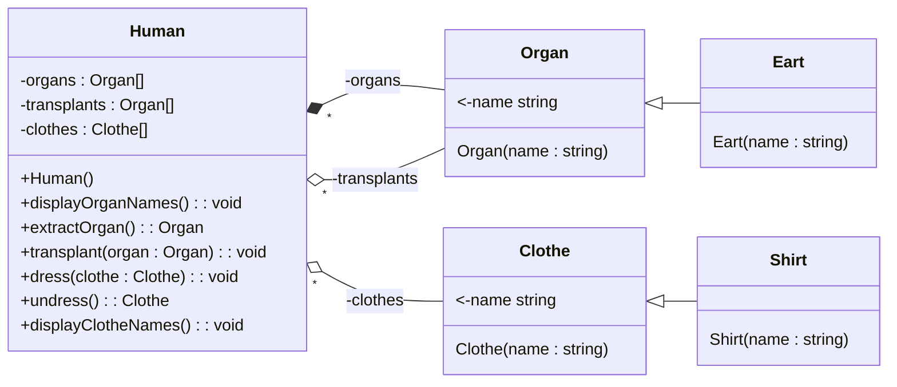

# transplant
An javascript implementation of a class diagram

```mermaid
  classDiagram
  direction LR
  class Human{
    -organs : Organ[]
    -transplants : Organ[]
    -clothes : Clothe[]
    +Human()
    +displayOrganNames() : void
    +extractOrgan() : Organ
    +transplant(organ : Organ) : void
    +dress(clothe : Clothe) : void
    +undress() : Clothe
    +displayClotheNames() : void
  }
  class Organ{
    <-name string
    Organ(name : string)
  }
  class Eart{
    Eart(name : string)
  }
  class Clothe{
    <-name string
    Clothe(name : string)
  }
  class Shirt{
    Shirt(name : string)
  }
  Human "*" *--Organ : -organs
  Human "*" o--Organ : -transplants
  Human "*" o--Clothe : -clothes
  Organ <|-- Eart
  Clothe <|-- Shirt
  link Human "https://github.com/Jean-Aymeric/transplant/blob/main/human.js"
  link Organ "https://github.com/Jean-Aymeric/transplant/blob/main/organ.js"
  link Eart "https://github.com/Jean-Aymeric/transplant/blob/main/eart.js"
  link Clothe "https://github.com/Jean-Aymeric/transplant/blob/main/clothe.js"
  link Shirt "https://github.com/Jean-Aymeric/transplant/blob/main/shirt.js"
```
